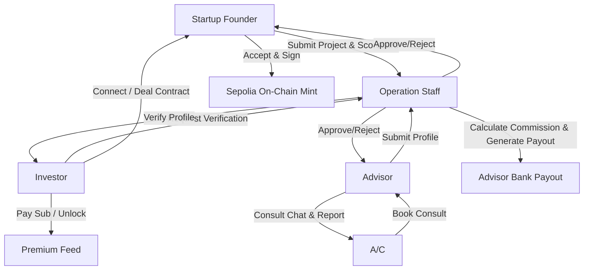

# AISEP Web Application (AI-Powered Startup Ecosystem Platform)

[](https://react.dev/)
[](https://vitejs.dev/)
[](https://learn.microsoft.com/en-us/aspnet/core/signalr/introduction)
[](https://sepolia.etherscan.io/)
[](https://sepay.vn/)

An enterprise-grade, multi-role web platform designed to facilitate interactions, matching, and transactions between startups, investors, and advisors. AISEP Web serves as the administrative, analytics, and operational hub of the ecosystem, powered by Gemini AI analysis, real-time communications, banking payment gateways, and on-chain blockchain verification.

---

## 🌐 Ngôn ngữ / Language
This documentation is written in both **English** and **Tiếng Việt** to accommodate global developers, stakeholders, and local operators.

*   [English Version](#english-documentation)
*   [Bản tiếng Việt](#tài-liệu-tiếng-việt)

---

# ENGLISH DOCUMENTATION

## 1. Core Product & Business Logic

AISEP Web operates on a secure, moderated ecosystem model involving five distinct user roles. It handles high-trust workflows including startup project submission audits, blockchain IP verification, advisory bookings, commission-deducted advisor payouts, and subscription unlocking.



### 1.1 Multi-Role Workspace Matrix
*   **Startup Founder (Enum: 0):** Builds project profiles, completes traction and market scorecards, registers intellectual property documents, requests AI Gemini audits, accepts investor deals, signs digital contracts, and schedules advisory sessions.
*   **Investor (Enum: 1):** Submits proof of assets for verification, unlocks premium startup projects via subscription packages, initiates connections, executes deals, signs contracts, and books advisors.
*   **Advisor (Enum: 2):** Registers professional credentials, defines consulting availability slots, conducts real-time chat consultation, submits post-session advisory reports, configures banking accounts, and tracks payout retries.
*   **Operation Staff (Enum: 3):** Performs manual KYC reviews on investors and advisors, approves/rejects startup project drafts, adjusts platform commission configurations, compiles monthly payouts into batches, and uploads bank transfer transaction evidence.
*   **Admin (Enum: 4):** Oversees platform settings, configures system enums, monitors dashboard analytics, and manages staff accounts.

### 1.2 The Project Lifecycle & Verification
The startup project workflow is designed to prevent spam while protecting intellectual property:
1.  **Draft Creation:** Startup provides core details (Name, Stage, UVP, Competitors, Business Model, scorecard values).
2.  **IP Protection (Blockchain):** Startup uploads PitchDeck/BusinessPlan. The platform generates a SHA-256 hash representing the files, saving this hash and the Ethereum transaction hash (`protectDocumentsOnBlockchain`).
3.  **Gemini AI Evaluation:** Triggered only after IP protection. Gemini analyzes metadata and files, generating an immutable **Startup Score (0-100)**, listing strengths, weaknesses, and risk levels with a reference-only disclaimer.
4.  **Staff Audit:** Startup submits the project. Staff reviews the documents and either approves (making it discoverable) or rejects it with a reason.
5.  **Matching Feed:** Approved projects appear in the matching feed. Investors see a **Non-Premium (blurred/teaser)** view unless they unlock the project with their premium subscription credits.

### 1.3 Deal Flow & Ethereum Sepolia Testnet Integration
Once connected, the investment agreement proceeds through a multi-step digital signature and on-chain mapping pipeline:
*   **Deal Initialization:** Investor initiates a deal (amount, equity %, exchange terms, evidence file).
*   **Startup Confirmation:** Startup accepts or rejects initial terms.
*   **Bilateral Contract Signing:**
    1.  The system renders a contract preview in HTML.
    2.  Investor signs digitally via signature canvas (submitting `signatureBase64`).
    3.  Startup reviews, signs, and executes the contract.
*   **On-Chain Registry:** Upon bilateral signature, the deal data is anchored onto the Ethereum Sepolia Testnet. The transaction registers:
    *   Bilateral document hash.
    *   Investor & Startup wallet mappings.
    *   Timestamp and unique Deal ID.
    *   Transaction links to `sepolia.etherscan.io` for verifiable trust.

### 1.4 Booking & Payout Lifecycle
Consultation bookings follow a strictly regulated financial flow:
1.  **Scheduling:** Startup/Investor books an advisor by choosing available slots.
2.  **Advisor Acceptance:** Advisor approves (moves status to `ApprovedAwaitingPayment`) or rejects (releasing slots).
3.  **Banking Checkout (SePay QR):** Customer makes a payment using a dynamic, banking-compliant QR code generated via SePay API.
4.  **Commission Deduction:** The platform tracks payments. Staff can configure the platform commission rate (`getCurrentCommission`).
5.  **Monthly Payout Batches:** Operation Staff generates monthly payout groups (`generateBatch`) between specific dates.
6.  **Staff Transfer & Proof Upload:** Staff transfers funds to the advisor's registered bank account and uploads the payment receipt (`ProofFile`).
7.  **Advisor Retry Note:** If a payout is rejected due to incorrect bank info, the advisor corrects their account and submits a retry request (`requestRetry`) with a resolution note.

### 1.5 Dynamic Form Validation Engine
To support changing compliance requirements without rebuilding the frontend, AISEP Web features a dynamic validation system:
*   **Runtime Rules:** Fetched from `/api/form-validation-rules/{formKey}` (e.g., `project.create`, `startup.update`).
*   **Conditional Stage Rules:** The system dynamically adjusts field requirements (e.g., revenue data is optional for "Idea" stage but required for "Growth" stage) using `stageOptionIds`.
*   **Unicode Regex Parsing:** Enforces strict patterns (like Vietnamese character sets) using `RegExp` with the `u` flag, identifying specific illegal characters for user feedback.

### 1.6 Dual-Channel Communication Flow
Real-time messaging is segmented based on the context:
1.  **Connection Chat:** Between Investors and Startups after a connection request is accepted. Messages are logged via `/api/ChatMessage?sessionId={id}`.
2.  **Booking Chat:** Between Advisor and Customer (Startup/Investor) during a confirmed consultation slot, managed via `/api/ChatSession/{bookingId}` and closed automatically when the booking is completed.
*   **Real-time sync:** Enabled via SignalR Hubs (`/hubs/notifications` and `/hubs/chat`), featuring connection state monitoring and automatic reconnect configurations.

---

## 2. Technical Architecture & Tech Stack

AISEP Web is built on a modern, decoupled React frontend utilizing Vite and standard CSS Modules.

### 2.1 Technology Stack
*   **UI Library:** React 19.2.3
*   **Build System:** Vite 6.0.7 (configured with `/api` and `/hubs` reverse-proxy mappings)
*   **Real-time Protocol:** `@microsoft/signalr` 8.0.7
*   **HTTP Client:** Axios (with interceptors for JWT injection, token refresh rotation, and bilingual error mapping)
*   **Iconography:** `lucide-react` 0.475.0
*   **Testing:** Vitest 2.1.8 & React Testing Library

### 2.2 Project Structure
```
AISEP_Web/
├── aisep/
│   ├── public/                  # Static assets & entry HTML
│   ├── src/
│   │   ├── assets/              # Static media assets
│   │   ├── components/          # Modular React components
│   │   │   ├── admin/           # Admin analytics & system settings
│   │   │   ├── advisor/         # Slots, report forms, approvals
│   │   │   ├── auth/            # LoginPage & bilingual RegisterForms
│   │   │   ├── booking/         # Scheduling widgets & SePay QR modal
│   │   │   ├── common/          # Avatars, Badges, FileUploads, terms modals
│   │   │   ├── feed/            # Discovery Hub & Project Detail cards
│   │   │   ├── investor/        # Deal requests & signature boards
│   │   │   ├── layout/          # Sidebar, RightPanel, Mobile BottomNav
│   │   │   ├── staff/           # PR Post editors, batch payout controls
│   │   │   └── subscription/    # Package pricing & checkout workflows
│   │   ├── constants/           # ProjectStatus, Scorecard option sets
│   │   ├── context/             # ThemeContext (light/dark), ProfileContext
│   │   ├── pages/               # Primary orchestrator views (Dashboards)
│   │   ├── services/            # API integration layer & SignalR Hub clients
│   │   ├── styles/              # global.css & variables.css (30+ tokens)
│   │   ├── utils/               # Time formatters & error translators
│   │   ├── App.jsx              # Main routing & view switchboard
│   │   └── main.jsx             # React DOM bootstrap
│   ├── vite.config.js           # Proxy configurations
│   ├── vercel.json              # Vercel deployment mappings
│   ├── .env                     # Local environment settings
│   └── package.json             # Build script configurations
└── README.md                    # Root repository guide
```

### 2.3 Styling and Design Tokens
The application implements a sleek, high-contrast, modern UI featuring:
*   **Persistent Theme System:** Light/Dark modes persist via `localStorage` and HTML attributes.
*   **CSS variables (`src/styles/variables.css`):**
    *   `--primary-blue: #1d9bf0` (brand highlights)
    *   `--bg-primary: #ffffff` / `#15202b` (light/dark backgrounds)
    *   `--score-good: #17bf63` / `--score-medium: #ffad1f` / `--score-poor: #e74c3c`

---

## 3. API & Services Integration Map

Frontend services under `src/services/` map directly to C# Backend endpoints:

| Service | Key Methods | Backend API Endpoint | Purpose |
|---------|-------------|----------------------|---------|
| `apiClient` | Request Interceptor | `Bearer {token}` injection | Authorized Requests |
| | Response Interceptor | `/api/Auth/refresh-token` | Silent Token Rotation & translation |
| `authService` | `register`, `login` | `POST /api/Auth/register`, `/login` | Authentication |
| | `confirmEmail` | `GET /api/Auth/confirm-email` | Email verification |
| `projectSubmissionService` | `createProject` | `POST /api/Projects` (Multipart) | Draft initialization |
| | `protectDocumentsOnBlockchain` | `BlockchainService.js` (Simulated) | Generates files checksum |
| | `submitProject` | `PATCH /api/Projects/{id}/submit` | Draft -> Pending review |
| | `getPendingProjects` | `GET /api/Projects?filters=Status==Pending` | Staff queue audit |
| | `approveProject` | `PUT /api/projects/{id}/approve` | Project launch |
| `AIEvaluationService` | `analyzeProjectAPI` | `POST /api/StartupAIAnalysis/{pid}/analyze` | Triggers Gemini AI audit |
| | `getProjectAnalysisHistory`| `GET /api/StartupAIAnalysis/{pid}` | Historic score tracking |
| `dealsService` | `createDeal` | `POST /api/Deals` (Multipart) | Proposed terms + evidence |
| | `signContract` | `POST /api/Deals/{id}/investor-sign` | Investor canvas signature |
| | `signContractStartup` | `POST /api/Deals/{id}/startup-sign` | Startup canvas signature |
| | `verifyDealOnchain` | `GET /api/Deals/{id}/verify-onchain` | Ethereum Sepolia NFT mint |
| `connectionService` | `createConnectionRequest`| `POST /api/connections/requests` | Investor connection request |
| | `getReceivedConnectionRequests` | `GET /api/connections/requests/received` | Startup inbound matches |
| `bookingService` | `createBooking` | `POST /api/Booking` | Slot reservation |
| | `approveBooking` | `PATCH /api/Booking/{id}/approve` | Advisor slots lock |
| `paymentService` | `checkoutBooking` | `POST /api/payments/bookings/{id}/checkout` | SePay QR generation |
| | `getBookingPaymentStatus`| `GET /api/payments/bookings/{id}/status` | Payment verification polling |
| `payoutService` | `generateBatch` | `POST /api/payout-groups/generate` | Staff payout batch generation |
| | `markPaid` | `PATCH /api/payouts/{id}/mark-paid` | Proof file upload |
| | `requestRetry` | `PATCH /api/payouts/{id}/request-retry` | Advisor bank detail update |
| `signalRService` | `initialize` | `/hubs/notifications`, `/hubs/chat` | Real-time WebSockets |

---

## 4. Development Setup & Deployment

### 4.1 Prerequisites
*   **NodeJS:** Version 18.x or 20.x
*   **Package Manager:** NPM (v9+)

### 4.2 Local Installation
1. Clone the repository and navigate to the project directory:
   ```bash
   git clone <repository-url>
   cd AISEP_Web/aisep
   ```
2. Install the dependencies:
   ```bash
   npm install
   ```
3. Configure your local environment variables in a `.env` file at the root of the `aisep` folder:
   ```env
   VITE_API_URL=https://api.aisep.tech
   VITE_ENV=development
   VITE_BLOCKCHAIN_EXPLORER_BASE_URL=https://sepolia.etherscan.io
   ```

### 4.3 Running the Application
*   **Development Mode:** Runs on `http://localhost:3000` with hot module reloading (HMR) and dev proxy forwarding:
    ```bash
    npm run dev
    ```
*   **Run Unit Tests:** Runs the Vitest suites:
    ```bash
    npm run test
    ```
*   **Build Production Bundle:** Optimizes and compiles assets into the `build/` folder:
    ```bash
    npm run build
    ```
*   **Preview Production Build:** Tests the built bundle locally:
    ```bash
    npm run preview
    ```

### 4.4 Main Application Workflows (Demo Videos)
To understand the system's operational flows, watch the interactive Canva demo videos below. You can click the badges to view the full presentation or use the embedded players.

#### 🎥 Flow 1: Startup Publish Project
Learn how startup founders upload documents, register intellectual property on the blockchain, and request AI Gemini evaluations.
*   **Link:** [Startup Publish Project Demo](https://canva.link/30ulra7hrp9gy33)
*   [](https://canva.link/30ulra7hrp9gy33)

<p align="center">
  <iframe src="https://canva.link/30ulra7hrp9gy33" width="100%" height="450" allowfullscreen style="border: 1px solid #7C3AED; border-radius: 12px;"></iframe>
</p>

#### 🎥 Flow 2: Investment Flow
See how verified investors discover premium projects, initiate deal terms, and execute bilateral smart contracts on Sepolia Testnet.
*   **Link:** [Investment Flow Demo](https://canva.link/xy69crzgvpohejd)
*   [](https://canva.link/xy69crzgvpohejd)

<p align="center">
  <iframe src="https://canva.link/xy69crzgvpohejd" width="100%" height="450" allowfullscreen style="border: 1px solid #7C3AED; border-radius: 12px;"></iframe>
</p>

#### 🎥 Flow 3: Advisor Booking Flow
Observe the advisor session scheduling, secure SePay banking QR payment clearance, and advisor post-session reporting processes.
*   **Link:** [Advisor Booking Flow Demo](https://canva.link/rafqc7spgnqwwxp)
*   [](https://canva.link/rafqc7spgnqwwxp)

<p align="center">
  <iframe src="https://canva.link/rafqc7spgnqwwxp" width="100%" height="450" allowfullscreen style="border: 1px solid #7C3AED; border-radius: 12px;"></iframe>
</p>

---

# TÀI LIỆU TIẾNG VIỆT

## 1. Nghiệp vụ Sản phẩm & Luồng logic cốt lõi

AISEP Web hoạt động trên mô hình hệ sinh thái được kiểm duyệt an toàn gồm 5 vai trò người dùng. Hệ thống xử lý các quy trình nghiệp vụ phức tạp như kiểm duyệt dự án khởi nghiệp, xác thực sở hữu trí tuệ trên blockchain, đặt lịch tư vấn, chi trả thù lao cho cố vấn và mở khóa dự án cao cấp.

### 1.1 Phân quyền Vai trò Người dùng
*   **Startup Founder (Enum: 0):** Thiết lập hồ sơ dự án, hoàn thành bảng điểm traction và quy mô thị trường (scorecard), đăng ký bảo hộ tài liệu trên blockchain, yêu cầu Gemini AI phân tích, phản hồi giao dịch đầu tư, ký hợp đồng điện tử và đặt lịch cố vấn.
*   **Investor (Enum: 1):** Gửi bằng chứng tài sản để được phê duyệt tài khoản, mở khóa dự án Startup Premium thông qua các gói đăng ký, gửi yêu cầu kết nối, đề xuất thương vụ, ký hợp đồng đầu tư và đặt lịch làm việc với cố vấn.
*   **Advisor (Enum: 2):** Đăng ký thông tin chuyên môn, thiết lập các khung giờ rảnh (availability slots), trò chuyện tư vấn trực tuyến, nộp báo cáo cố vấn sau phiên làm việc, cấu hình tài khoản ngân hàng nhận tiền và gửi yêu cầu kiểm tra lại lệnh chuyển tiền lỗi.
*   **Operation Staff (Enum: 3):** Phê duyệt thủ công hồ sơ nhà đầu tư và cố vấn, kiểm duyệt dự án khởi nghiệp draft, cấu hình tỷ lệ chiết khấu hoa hồng của hệ thống, tạo lô thanh toán hàng tháng và tải lên biên lai chuyển khoản thù lao.
*   **Admin (Enum: 4):** Giám sát các thiết lập hệ thống, quản lý cấu hình các phân loại (enums), phân tích số liệu trên dashboard tổng và quản trị tài khoản nhân viên.

### 1.2 Vòng đời Dự án & Quy trình Xác thực
Luồng xử lý dự án khởi nghiệp được thiết kế chặt chẽ nhằm tránh spam và bảo vệ ý tưởng:
1.  **Khởi tạo Nháp (Draft):** Startup cung cấp thông tin cơ bản (Tên, UVP, Competitors, Business Model, số liệu tài chính trên Scorecard).
2.  **Bảo hộ Sở hữu Trí tuệ (IP Protection):** Startup tải lên PitchDeck/BusinessPlan. Hệ thống tạo mã băm SHA-256 từ tệp tin và lưu trữ kèm mã giao dịch (txHash) trên blockchain (`protectDocumentsOnBlockchain`).
3.  **Gemini AI Đánh giá:** Chỉ thực hiện sau khi hoàn tất bước bảo hộ IP. Gemini phân tích tài liệu và metadata để đưa ra **Startup Score (0-100)** cùng danh sách điểm mạnh, điểm yếu và chỉ số rủi ro (kèm tuyên bố miễn trừ trách nhiệm).
4.  **Nhân viên Phê duyệt:** Startup gửi dự án cho ban quản trị duyệt. Nhân viên xem xét tài liệu gốc và chọn phê duyệt (để hiển thị lên bảng tin) hoặc từ chối kèm lý do.
5.  **Bảng tin Khám phá:** Dự án đã duyệt xuất hiện trên bảng tin. Nhà đầu tư thông thường chỉ xem được bản **Non-Premium (bị làm mờ số liệu)** cho đến khi dùng điểm premium để mở khóa.

### 1.3 Quy trình Đầu tư & Tích hợp Ethereum Sepolia Testnet
Khi kết nối được thiết lập, thỏa thuận đầu tư trải qua quy trình ký kết số và đồng bộ on-chain:
*   **Đề xuất Deal:** Nhà đầu tư gửi đề xuất đầu tư (số vốn, tỷ lệ cổ phần, điều khoản trao đổi, tệp minh chứng chuyển khoản).
*   **Startup Phản hồi:** Startup đồng ý hoặc từ chối các điều khoản ban đầu.
*   **Ký kết hợp đồng song phương:**
    1.  Hệ thống hiển thị bản xem trước hợp đồng (Contract Preview HTML).
    2.  Nhà đầu tư ký trên bảng vẽ cảm ứng (gửi mã `signatureBase64`).
    3.  Startup xem xét, ký xác nhận để hoàn tất hợp đồng.
*   **Đăng ký On-chain:** Ngay khi hai bên ký xong, thông tin thương vụ được ghi nhận vào Ethereum Sepolia Testnet thông qua API `/api/Deals/{id}/verify-onchain`. Lịch sử giao dịch liên kết trực tiếp tới `sepolia.etherscan.io`.

### 1.4 Quy trình Đặt lịch & Chi trả (Booking & Payout)
Các buổi tư vấn cố vấn tuân theo quy trình kiểm soát tài chính nghiêm ngặt:
1.  **Đặt lịch:** Khách hàng (Startup/Investor) chọn khung giờ trống của cố vấn để tạo lịch hẹn.
2.  **Cố vấn phản hồi:** Cố vấn chấp nhận (chuyển trạng thái chờ thanh toán) hoặc từ chối (giải phóng khung giờ).
3.  **Thanh toán SePay QR:** Khách hàng quét mã QR động được sinh tự động thông qua SePay API kết nối với hệ thống ngân hàng Việt Nam.
4.  **Khấu trừ Hoa hồng:** Hệ thống theo dõi thanh toán. Nhân viên có thể điều chỉnh tỷ lệ phần trăm hoa hồng nền tảng (`getCurrentCommission`).
5.  **Tạo lô chi trả hàng tháng:** Nhân viên vận hành gom các giao dịch hoàn thành vào một nhóm chi trả (`generateBatch`) theo khoảng thời gian.
6.  **Chuyển khoản & Đính kèm Minh chứng:** Nhân viên chuyển khoản thù lao cho cố vấn và tải lên ảnh chụp biên lai chuyển tiền (`ProofFile`).
7.  **Yêu cầu Thử lại (Retry):** Nếu lệnh chuyển khoản bị lỗi do sai thông tin ngân hàng, cố vấn cập nhật lại thẻ ngân hàng và gửi yêu cầu thử lại (`requestRetry`) kèm ghi chú giải trình.

### 1.5 Bộ máy Kiểm tra Dữ liệu Động (Dynamic Form Validation Engine)
Hệ thống cho phép cấu hình quy tắc kiểm tra biểu mẫu từ máy chủ mà không cần build lại client:
*   **Rules động:** Tải trực tiếp từ `/api/form-validation-rules/{formKey}`.
*   **Enforce theo Giai đoạn:** Tự động điều chỉnh trường bắt buộc dựa trên giai đoạn phát triển của dự án (ví dụ: số liệu doanh thu bắt buộc ở giai đoạn "Tăng trưởng" nhưng là tùy chọn ở giai đoạn "Ý tưởng") thông qua `stageOptionIds`.
*   **Regex Unicode:** Sử dụng cờ `u` để kiểm tra chuẩn ký tự tiếng Việt có dấu, bóc tách các ký tự vi phạm để hiển thị cảnh báo chi tiết.

### 1.6 Giao tiếp Thời gian thực Hai kênh (SignalR WebSockets)
Hệ thống chat được chia tách theo ngữ cảnh:
1.  **Chat Kết nối:** Startup trò chuyện với Investor sau khi chấp nhận kết nối. Dữ liệu lưu qua `/api/ChatMessage?sessionId={id}`.
2.  **Chat Cố vấn:** Cố vấn trò chuyện với Khách hàng sau khi xác nhận lịch hẹn tư vấn. Phiên chat tự động đóng khi buổi hẹn kết thúc.
*   **Đồng bộ thời gian thực:** Quản lý bởi SignalR Hubs (`/hubs/notifications` và `/hubs/chat`), hỗ trợ tự động kết nối lại khi mất mạng.

---

## 2. Kiến trúc Hệ thống & Công nghệ sử dụng

AISEP Web là ứng dụng Single Page Application (SPA) viết bằng React và được build bằng công cụ Vite.

### 2.1 Công nghệ chính
*   **Thư viện UI:** React 19.2.3
*   **Công cụ Build:** Vite 6.0.7 (cấu hình proxy ngược cho `/api` và `/hubs` để tránh lỗi CORS)
*   **Giao thức thời gian thực:** `@microsoft/signalr` 8.0.7
*   **HTTP Client:** Axios (cấu hình interceptor để tự động chèn token JWT, tự động làm mới token hết hạn - Refresh Token và dịch thông báo lỗi từ backend)
*   **Icon:** `lucide-react` 0.475.0

### 2.2 Quản lý Layout và Thiết kế giao diện
Ứng dụng sử dụng ngôn ngữ thiết kế phẳng, hiện đại và tối giản (lấy cảm hứng từ giao diện Twitter/X):
*   **Theme chuyển đổi:** Lưu trạng thái sáng/tối trong `localStorage` và cập nhật trực tiếp lên thuộc tính `data-theme` của thẻ HTML.
*   **CSS Tokens:** Định nghĩa trong `src/styles/variables.css` giúp quản lý màu sắc và khoảng cách đồng bộ.

---

## 3. Bản đồ Tích hợp API & Các Dịch vụ

*(Xem bảng chi tiết ở [phần tiếng Anh phía trên](#3-api--services-integration-map) để đối chiếu trực tiếp mã API Endpoint và tên Service trong mã nguồn).*

---

## 4. Hướng dẫn Cài đặt & Vận hành

### 4.1 Yêu cầu hệ thống
*   **NodeJS:** Phiên bản 18.x hoặc 20.x trở lên
*   **Package Manager:** NPM (v9+)

### 4.2 Cài đặt cục bộ
1. Tải mã nguồn và truy cập thư mục ứng dụng:
   ```bash
   git clone <repository-url>
   cd AISEP_Web/aisep
   ```
2. Cài đặt các gói thư viện:
   ```bash
   npm install
   ```
3. Tạo tệp `.env` tại thư mục `aisep/` với nội dung cấu hình sau:
   ```env
   VITE_API_URL=https://api.aisep.tech
   VITE_ENV=development
   VITE_BLOCKCHAIN_EXPLORER_BASE_URL=https://sepolia.etherscan.io
   ```

### 4.3 Lệnh chạy ứng dụng
*   **Chạy chế độ Phát triển (Dev):** Khởi chạy tại địa chỉ `http://localhost:3000`:
    ```bash
    npm run dev
    ```
*   **Chạy kiểm thử (Unit Test):**
    ```bash
    npm run test
    ```
*   **Build Đóng gói Production:** Biên dịch và tối ưu hóa mã nguồn vào thư mục `build/`:
    ```bash
    npm run build
    ```
*   **Xem trước bản Build (Preview):** Chạy thử bản build production tại máy cục bộ:
    ```bash
    npm run preview
    ```

### 4.4 Luồng Hoạt Động Chính (Video Demo)
Để hiểu rõ hơn các luồng vận hành thực tế của hệ thống, vui lòng xem các video giới thiệu Canva tương tác bên dưới. Bạn có thể nhấn vào các huy hiệu badge để xem trực tiếp hoặc sử dụng trình phát nhúng.

#### 🎥 Luồng 1: Startup Đăng Ký Dự Án & Bảo Hộ IP
Quy trình người sáng lập dự án tải lên tài liệu, đăng ký bảo hộ sở hữu trí tuệ trên blockchain Sepolia và thực hiện phân tích tự động bằng Gemini AI.
*   **Liên kết:** [Demo Đăng Ký Dự Án & Bảo Hộ IP](https://canva.link/30ulra7hrp9gy33)
*   [](https://canva.link/30ulra7hrp9gy33)

<p align="center">
  <iframe src="https://canva.link/30ulra7hrp9gy33" width="100%" height="450" allowfullscreen style="border: 1px solid #7C3AED; border-radius: 12px;"></iframe>
</p>

#### 🎥 Luồng 2: Luồng Đầu Tư & Ký Hợp Đồng
Quy trình nhà đầu tư đã xác minh tìm kiếm dự án cao cấp, gửi đề xuất thương vụ đầu tư và hoàn tất hợp đồng ký kết song phương ghi nhận on-chain.
*   **Liên kết:** [Demo Luồng Đầu Tư](https://canva.link/xy69crzgvpohejd)
*   [](https://canva.link/xy69crzgvpohejd)

<p align="center">
  <iframe src="https://canva.link/xy69crzgvpohejd" width="100%" height="450" allowfullscreen style="border: 1px solid #7C3AED; border-radius: 12px;"></iframe>
</p>

#### 🎥 Luồng 3: Luồng Đặt Lịch Cố Vấn & Chi Trả
Quy trình đặt lịch tư vấn với chuyên gia, thanh toán tự động qua cổng SePay bằng mã QR ngân hàng và cố vấn gửi báo cáo tư vấn.
*   **Liên kết:** [Demo Đặt Lịch Cố Vấn](https://canva.link/rafqc7spgnqwwxp)
*   [](https://canva.link/rafqc7spgnqwwxp)

<p align="center">
  <iframe src="https://canva.link/rafqc7spgnqwwxp" width="100%" height="450" allowfullscreen style="border: 1px solid #7C3AED; border-radius: 12px;"></iframe>
</p>